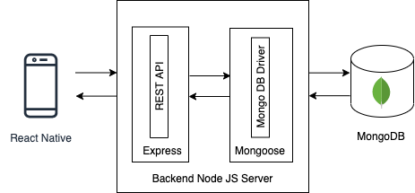

# Pool Project

[](https://www.codefactor.io/repository/github/no-domestic-violence/mobile-app)
[](https://github.com/prettier/prettier)

## Table of contents

- [Project Description](#project-description)
- [Tech Stack](#tech-stack)
- [Application architecture diagram](#application-architecture-diagram)
- [Setup](#setup)
- [Authors of the project](#authors-of-the-project)

## Project Description
POOL project is a mobile application that aims to help the survivors of domestic violence. The main features of the app are: resources in forms of curated articles, videos & podcasts about intimate partner violence, finding shelters and hotlines. Signed up users can have additional access to emergency contact features. 

**Tech Stack**
- React Native with Expo
- The latest version of React Navigation v5
- Context API + hooks for state management
- Font Awesome for icons
- Axios for API calls
- I18next and expo-localization for localization
- React-native-maps for maps
- Expo-location for reading geolocation information from the device
- React-native-elements for material ui styling ans Styled components
---

## Application architecture diagram



**To run locally**

1. Install dependencies:

```s
yarn install
```

2. Start environment

```s
yarn start
```

3. Before merging to master, check errors

```s
yarn lint
```

**To test in development mode or production mode**

1. It runs by default in development mode

2. To run in production mode 

```s
expo start --no-dev --minify
```

**To test in development mode with device**


1. Login to expo with given credentials :

```s
expo login
```

2. Open expo app from your device and login with the same credentials and you can start manually testing your work

**To test in production mode with device**

Publish the app in production mode with expo

**To build bundles**
```s
expo build:android -t app-bundle
```

```s
expo build:ios (only with paid developer account)
```

---
## Authors of the project:

- Soyoon Choi  
- Irina Baeva
- Behnaz Derakhshani 
